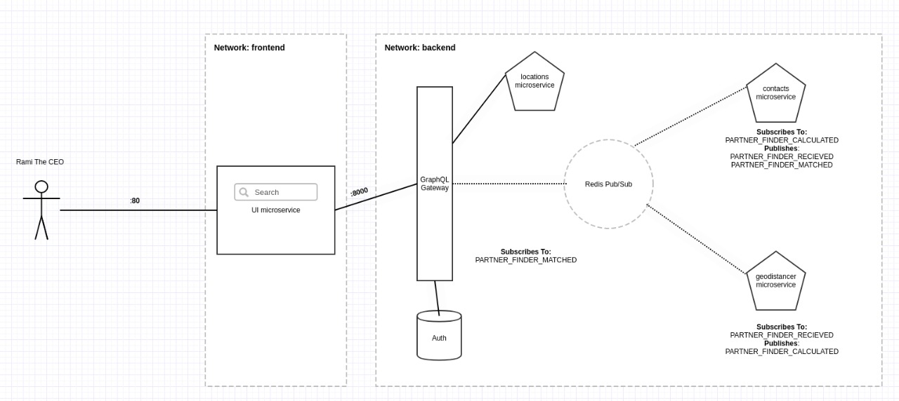

# Partner Finder Skills Test Project

## Business Requirments:

```
Our CEO, Rami,  would like to reach out to our partners with offices within a given range of Starbucks Cafe Central London (51.5144636,-0.142571), to invite them for a business meal on Monday at noon. 

Your help is much appreciated here, as we want to have an API that we can call to list the contact details of those partners, given the range (in kilometers). And this should be a very useful micorservice in the further where we can add similar APIs. 

It should be implemented using NodeJS; feel free to choose a framework to use but we suggest using Express. And you should share with us the docker image to be deployed along with the complete source code which should be tracked by Git. 

Please make sure you submit your code as to be shipped to production. The details matter. Code should be well structured, and fully tested (automated integration and/or unit tests are a plus).

Your API should read the list of partners (from the attached JSON file), and return the company names and addresses of the matching partners (with offices within the given range in kilometers) sorted by company name in ascending order.

And of course, it would be great to have a nice UI that Rami can use instead of directly calling the API. (This’s optional)

You should be using the following formula to calculate the distance: https://en.wikipedia.org/wiki/Great-circle_distance. And don't forget to convert degrees to radians!
```

## Features

- Mimics Event Based Architecture having redis as the events message backbone
- Microservices
    - Graphql Gateway: the application main entry point.
    - locations: Responsible for returning locations.
    - contacts: Responsible for Partners management.
    - geodistancer: Responsible for calculating distance from selected city.
    - auth: Mongodb service to store users credentials.

## Architecture at 1000 KM View





## Limitation

- Missing integration tests and unit tests.
- More work to be done on validation.
- Use Kafka instead of redis for events (I need to learn kafka more in order to implement event sourcing).
- Todo The distance calculation make use of factory pattern and let the service request initiator to choose what calculation method to choose.


## How to use

- cd <project_dir> 
- chmod +x runnable.sh
- ./runnable.sh
- go to browser and access localhost on port 80
